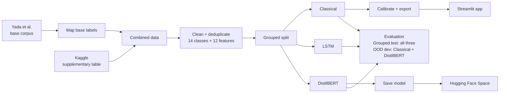

# Dark Pattern Text Risk Screener

<p align="left">
  <a href="https://dark-patterns.streamlit.app/" target="_blank">
    
  </a>
  <a href="https://huggingface.co/spaces/goyashek/distilbert-darkpattern" target="_blank">
    
  </a>
</p>

This project explores whether short interface text can be classified into the 13 dark-pattern categories described in India's 2023 CCPA guidelines. It also includes a `Not a Dark Pattern` class for benign text.

The models only read text. They cannot inspect layout, default selections, repeated prompts, cart changes, or a complete signup or cancellation flow. Their output is a screening result, not a legal or compliance finding.

## Results

All three models use the same grouped split of 5,051 training rows and 1,322 test rows. Rows that share a source page or normalized text pattern remain on the same side of the split.

| Model | Test macro-F1 | Test accuracy | OOD-dev macro-F1 | OOD-dev accuracy | Size |
| :--- | :---: | :---: | :---: | :---: | :---: |
| DistilBERT (fine-tuned) | **0.883** | **0.911** | 0.694 | 0.857 | ~269 MB |
| Character TF-IDF + 12 features + SMOTE + calibrated LinearSVC | 0.730 | 0.816 | **0.752** | **0.893** | ~4.4 MB |
| LSTM (from scratch) | 0.657 | 0.784 | n/a | n/a | ~5 MB |

DistilBERT performs best on the grouped test set, while the smaller classical model records the strongest results on the OOD-development set. The LSTM remains a useful from-scratch neural baseline but falls behind both approaches.

The OOD-development set contains 28 manually collected Indian UI strings across 9 classes. It has no benign examples and influenced later model decisions, so it is diagnostic rather than an independent final test set.

At the provisional 50% DistilBERT display threshold, the model covers 27 of the 28 rows and correctly classifies 24 of those 27.

## Data and labels

The source tables used in this project were obtained from the [Dark Patterns User Interfaces dataset on Kaggle](https://www.kaggle.com/datasets/dhamur/dark-patterns-user-interfaces). The base corpus comes from Yada et al.'s paper, [Dark patterns in e-commerce: a dataset and its baseline evaluations](https://arxiv.org/abs/2211.06543).

After label mapping, cleaning, and deduplication, the final dataset contains 6,373 unique text strings across 14 classes:

- 2,157 rows retained from the Yada et al. base corpus
- 4,216 rows retained from the supplementary table

The Yada et al. base corpus uses a different taxonomy, so I mapped its labels into the 13 CCPA categories used by this project, plus `Not a Dark Pattern`. The supplementary table already uses this 14-class label space. The mapping reflects my interpretation of the guidelines and has not been approved by the CCPA or reviewed by a legal domain expert.

Before splitting the data, I removed invalid rows and normalized duplicate text.

## Train-test leakage audit

My initial random split reached a macro-F1 of about 0.96. This appeared overly optimistic, so I examined the relationship between rows on both sides of the split.

Although exact duplicates had been removed, many rows still contained closely related wording. The audit found that 64.8% of test rows in the random split shared a normalized text pattern with a training row.

I replaced the random split with connected grouping based on source `page_id` and normalized text patterns. Each connected group remains entirely within either training or test.

## Models

### Classical model

The Streamlit app uses a compact classical pipeline built from character 2-6 gram TF-IDF, 12 focused text features, SMOTE within the training folds, and a LinearSVC classifier. I compare three LinearSVC settings using grouped cross-validation and apply grouped sigmoid calibration to the selected model.

The features cover urgency and scarcity terms, confirm-shaming and cancellation wording, social proof, pricing, discounts, negative options, punctuation, numbers, and time references.

The app displays these signals alongside the model prediction. They are diagnostic cues, not an exact explanation of how the classifier reached its decision.

### LSTM

For a neural baseline, I trained a small LSTM from scratch on the same grouped training partition. It learned its vocabulary from roughly 5,000 training rows and reached 0.657 macro-F1 on the test set, below the classical model and DistilBERT.

### DistilBERT

I fine-tuned DistilBERT on the same grouped training partition. It achieved the strongest grouped-test result, with 0.883 macro-F1 and 0.911 accuracy.

The model is considerably larger than the classical pipeline, and its softmax scores are not calibrated confidence values. The Hugging Face demo reports a top score below the provisional 50% display threshold as inconclusive.

## Classical model checks

I used the grouped training folds to check whether the engineered features, SMOTE, and older word-level pipelines improved the classical model. The final test set was not used for this comparison.

| Training-only variant | Grouped CV macro-F1 |
| :--- | :---: |
| Character TF-IDF + class-weighted LinearSVC | **0.776 ± 0.030** |
| Character TF-IDF + 12 engineered features | 0.739 ± 0.046 |
| Character TF-IDF + engineered features + SMOTE | 0.739 ± 0.050 |
| Deployed: character TF-IDF + 12 features + SMOTE | **0.739 ± 0.059** |
| Legacy word TF-IDF + engineered features + SMOTE + SVC | 0.555 ± 0.034 |
| Legacy word TF-IDF + engineered features + SMOTE + XGBoost | 0.559 ± 0.034 |

The results favored character TF-IDF with LinearSVC over the older word-level pipelines. The simpler class-weighted variant produced the highest cross-validation mean, while the engineered features and SMOTE remained close to 0.739.

Although the class-weighted text-only variant achieved the highest cross-validation mean, the 12-feature pipeline remains the deployed model because it is reproduced consistently across both modeling notebooks, the exported artifact, and the Streamlit app. It also preserves one preprocessing and calibration workflow from training through inference.

The convergence warning disappeared after raising the LinearSVC iteration limit to 5,000, but the score stayed the same. Three XGBoost trials scored between 0.549 and 0.576, so I stopped the search.

## Notebook workflow

The project is organized as a three-notebook experiment.

1. Notebook 1 prepares the data, applies the project label mapping, removes duplicate text, performs EDA, and writes the shared 12-feature table.
2. Notebook 2 runs the grouped classical-model comparison, calibrates the selected LinearSVC pipeline, and exports the artifact used by Streamlit.
3. Notebook 3 trains the LSTM and DistilBERT models on the same split and compares them with the classical pipeline on the grouped test and OOD-development data.

Saved outputs are included for review. Classical retraining is disabled by default in Notebook 2, while the full DistilBERT training workflow is intended for Colab.

## Pipeline



## Project structure

```text
.
├── notebooks/
│   ├── 01_data_nlp_eda.ipynb
│   ├── 02_model_tuning_export.ipynb
│   └── 03_deep_learning_transformer.ipynb
├── src/
│   ├── features.py
│   ├── leak_audit.py
│   ├── make_features.py
│   └── train.py
├── app/app.py
├── hf_space/app.py
├── data/
│   ├── raw/
│   └── processed/
├── models/          # exported classical pipeline
├── reports/         # metrics and leakage-audit outputs
└── tests/
```

The DistilBERT weights are hosted separately on Hugging Face rather than stored in the repository.

## Running the project

Install the dependencies:

```bash
pip install -r requirements.txt
```

Run the tests:

```bash
python -m unittest discover -s tests -v
```

Launch the classical app:

```bash
streamlit run app/app.py
```

DistilBERT training is handled in Notebook 3 and is intended to run in Colab. The trained outputs are saved in the notebook for review.

## Live demos

- [Classical model: Streamlit](https://dark-patterns.streamlit.app/)
- [DistilBERT: Hugging Face Space](https://huggingface.co/spaces/goyashek/distilbert-darkpattern)

## Limitations

- The mapping from the source labels to the CCPA categories is a project-level interpretation, not an official or legally reviewed taxonomy.
- Although related rows are kept together through grouped splitting, the test data still comes from the same underlying source dataset.
- The OOD-development set is small and incomplete: it contains 28 examples across 9 classes, no benign examples, and was used during model development.
- The models classify isolated text and cannot evaluate layout, defaults, cart behavior, repeated prompts, or complete interaction flows.
- DistilBERT's softmax scores are not calibrated confidence values. The 50% boundary is used only to control how predictions are displayed.

## Author

**Abhishek Goyal**<br>
[Portfolio](https://goyashek.github.io) · [GitHub](https://github.com/goyashek)

## Disclaimer

This project is intended for educational use only. Its category mapping is based on my reading of the CCPA dark-pattern guidelines and has not been officially approved or legally reviewed. The results do not constitute legal or compliance advice.
