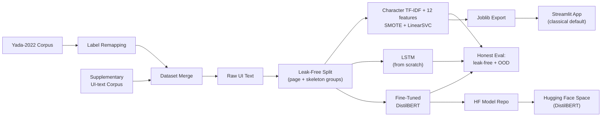

# Dark Pattern Text Risk Screener

<p align="left">
  <a href="https://dark-patterns.streamlit.app/" target="_blank">
    
  </a>
  <a href="https://huggingface.co/spaces/goyashek/distilbert-darkpattern" target="_blank">
    
  </a>
  <a href="https://github.com/goyashek" target="_blank">
    
  </a>
</p>

A research prototype that reads website/application UI text and maps it onto **14 model classes**: the **13 dark-pattern categories** named by India's Central Consumer Protection Authority (CCPA) in 2023 plus *Not a Dark Pattern*. It screens for possible textual signals; it cannot determine compliance from a single snippet.

> [!NOTE]
> **Two live research demos**: the compact **classical** model on [dark-patterns.streamlit.app](https://dark-patterns.streamlit.app/), and the **fine-tuned DistilBERT** on [its Hugging Face Space](https://huggingface.co/spaces/goyashek/distilbert-darkpattern). The HF demo reports top scores below 50% as inconclusive instead of relabeling them benign.

---

## 🇮🇳 Regulatory Context & Motivation

> India's 2023 CCPA guidelines name 13 dark-pattern categories. Many depend on visual hierarchy, defaults, repetition, pricing stages, or a complete signup/cancellation flow.
> This project supports research and human review; its text classifications are not legal findings.

---

## 🔬 Bridging Academic Taxonomy and Legal Reality

This project maps the academic baseline corpus (**Yada et al. 2022**) onto CCPA legal compliance classes.

### Comparative Analysis: Baseline vs. This Project

| Feature / Metric | Yada et al. 2022 (Baseline) | This Project |
| :--- | :--- | :--- |
| **Label Space** | Binary + 7 Academic Taxonomy Classes | **14 Classes** (13 named categories + no-dark-pattern) |
| **Practical Context** | Academic Research | **Research risk screening** |
| **Class Coverage** | Missing legal categories, high class skew | **All 13 CCPA classes represented** |
| **Explainability** | Black-box Transformer predictions | **Both offered**: separate lexical signal badges with the classical model and a fine-tuned DistilBERT |
| **Inference Layer** | Raw uncalibrated model outputs | **Grouped sigmoid calibration (classical); provisional abstention (HF)** |

---

## ⚖️ The Core Tradeoff: Interpretable Classical vs. Fine-Tuned Transformer

The test results use the same split, which keeps both page IDs and generated template families together. The OOD columns were cheaply refreshed from the two saved deployment artifacts without retraining.

| Model | Test Macro-F1 | Test Accuracy | OOD-dev Macro-F1 | OOD-dev Accuracy | Size |
| :--- | :---: | :---: | :---: | :---: | :---: |
| **DistilBERT (fine-tuned)** | **0.883** | **0.911** | 0.694 | 0.857 | ~269 MB |
| Character TF-IDF + 12 features + SMOTE + calibrated LinearSVC | 0.730 | 0.816 | **0.752** | **0.893** | ~4.4 MB |
| LSTM (from scratch) | 0.657 | 0.784 | — | — | ~5 MB |

> [!NOTE]
> The test columns are the latest Notebook 3 results on the shared 5,051/1,322 page-and-template-grouped split. The OOD columns use the saved classical and DistilBERT artifacts on the refreshed set. The LSTM was not saved or rerun on it. At the provisional 50% DistilBERT threshold, 27/28 rows are covered and 24/27 covered predictions are correct.

### Why a Leak-Free Split Matters

A naive random split reported a flattering **~0.96** macro-F1. On this corpus, **64.8%** of a naive test set has a template twin in training. The current split joins rows transitively by either normalized skeleton or source `page_id`, then keeps each connected group on one side. The latest Notebook 3 classical refit scores **0.730 macro-F1** on that 1,322-row source-clean test.

### Why an Out-of-Distribution Test

The 28 scraped Indian UI strings are useful diagnostics, but they cover only 9 classes, have no benign examples, and have already influenced development. Some OOD entries are from CCPA orders. They are therefore reported as **OOD development data**, not an independent final test.

---

## 🗺️ Pipeline & Flowchart


---

## 🛠️ Advanced Techniques & Rationale (Why We Did Them)

### 1. Global De-duplication — and Why It Wasn't Enough
* **Why**: Removing identical UI strings before splitting is the first defense against train/test leakage.
* **The catch we found**: exact-match dedup misses **near-duplicates** and related strings from the same page. The current leak audit groups by both normalized skeleton and `page_id`; the refreshed classical model scores 0.732 on that split.

### 2. Page + Template Grouping
* **Why**: A page can contain several related strings, while generated rows can share a template. Connected-component groups prevent either relationship from crossing a fold or the final split.

### 3. Character TF-IDF + 12 Focused Features
* **Why**: Character 2-6 grams preserve short fragments, punctuation, prices, and spelling variants. Eight keyword signals plus exclamation, question, number, and time flags retain the most relevant engineered context without the full 22-feature block.

### 4. Small Grouped Model Search
* **Why**: Three LinearSVC settings (`C` in 0.5/1/2) are compared with five-fold grouped macro-F1. The selected `C=0.5` model reached `0.739 ± 0.059` inside the training partition.

### 5. Grouped Sigmoid Calibration
* **Why**: LinearSVC supplies the decision boundary; grouped out-of-fold sigmoid calibration supplies `predict_proba` for the app without mixing page or template families.

### 6. Separate Signal Badges
* **Why**: The Streamlit badges remain lightweight lexical cues. They are shown separately and are not presented as the classifier's exact reasoning.

### What happened to the old advanced pipeline?

I reran its components with the same five page/template-grouped training folds used for the new
model. This is an ablation, not a comparison on the final test.

| Training-only variant | Grouped CV Macro-F1 |
| :--- | :---: |
| Character TF-IDF + class-weighted LinearSVC | **0.776 ± 0.030** |
| Character TF-IDF + 12 engineered features | 0.739 ± 0.046 |
| Character TF-IDF + engineered features + SMOTE | 0.739 ± 0.050 |
| **Deployed: character TF-IDF + 12 features + SMOTE** | **0.739 ± 0.059** |
| Legacy word TF-IDF + engineered features + SMOTE + SVC | 0.555 ± 0.034 |
| Legacy word TF-IDF + engineered features + SMOTE + XGBoost | 0.559 ± 0.034 |

The engineered-feature variant initially hit LinearSVC's iteration limit; raising it to 5,000
iterations converged at the same 0.739 result. A fresh grouped Optuna check for XGBoost completed
three trials at 0.566, 0.576, and 0.549 before I stopped it:
the best result was still 0.200 below the character model. SMOTE, scaling, feature engineering,
XGBoost, and Optuna were therefore tested rather than silently discarded; they did not earn a
place in the deployment pipeline under the corrected validation setup.

---

## 📂 Codebase Architecture

```
dark-pattern-detector/
├── README.md
├── requirements.txt
│
├── notebooks/
│   ├── 01_data_nlp_eda.ipynb              # EDA, tokenization & keyword extraction
│   ├── 02_model_tuning_export.ipynb       # self-contained classical tuning and export
│   └── 03_deep_learning_transformer.ipynb # current classical, LSTM and DistilBERT comparison
│
├── data/
│   ├─ raw/
│   │   ├── dataset_raw.tsv                 # Yada et al. corpus
│   │   └── pattern_label.csv               # supplementary UI-text corpus
│   └──  processed/
│       ├── ccpa_dataset.tsv                # cleaned & remapped corpus
│       ├── features.csv                    # final data after feature engineering
│       └── ood_real_test.csv               # 28-string OOD development set
│
├── models/
│   ├── best_multi_model.joblib            # calibrated character/features/SMOTE pipeline
│   ├── best_binary_model.joblib           # legacy artifact, not used by the app
│   └── label_encoder.joblib               # target class encoder
│                                          # (DistilBERT weights live on the HF Model repo)
│
├── app/
│   └── app.py                             # Streamlit dashboard (classical)
│
└── hf_space/
    └── app.py                             # Gradio app for the DistilBERT HF Space
```

---

## 🚀 How to Run the Project

### Install Dependencies
```bash
pip install -r requirements.txt
```

### Reproduce the Notebooks
```bash
jupyter notebook notebooks/01_data_nlp_eda.ipynb
jupyter notebook notebooks/02_model_tuning_export.ipynb
jupyter notebook notebooks/03_deep_learning_transformer.ipynb
```

The notebooks contain their preprocessing and model code directly. Set `RUN_TRAINING=True` in
Notebook 2 to replace the classical artifact, and `RUN_BERT=True` in Notebook 3 for the full
transformer rerun.

### Launch the Dashboards
```bash
streamlit run app/app.py    # classical model (fast, interpretable default)
```
The fine-tuned **DistilBERT** demo runs as a [Hugging Face Space](https://huggingface.co/spaces/goyashek/distilbert-darkpattern) (`hf_space/app.py`), loading its weights from a separate HF Model repo.

---

## 🔬 The 12 Engineered Features

The notebook, saved feature table, training pipeline, and Streamlit app now share the same compact feature contract.
- **Lexical/Keyword Triggers**: urgency_kw_count, scarcity_kw_count, shame_phrase_flag, cancel_diff_score, social_proof_flag, price_drip_flag, discount_claim_flag, neg_option_flag.
- **Structural Indicators**: exclamation_count, question_count, number_present, time_reference_flag.

---

## 👨‍💻 Author & Credits
- **Created By**: [Abhishek Goyal](https://goyashek.github.io)
- **GitHub**: [github.com/goyashek](https://github.com/goyashek)
- **Kaggle Source**: Indian context compliance dataset sourced from Kaggle: **[https://www.kaggle.com/datasets/dhamur/dark-patterns-user-interfaces]**

---

## ⚠️ Disclaimer
> [!WARNING]
> This is a student project. I mapped the dataset labels to the CCPA dark-pattern categories based on my own reading of the guidelines. The mapping is not official or approved by the CCPA, and the results should not be used as legal or compliance advice.
