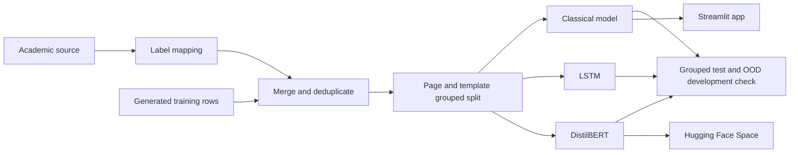

# Dark Pattern Text Risk Screener

<p align="left">
  <a href="https://dark-patterns.streamlit.app/" target="_blank">
    
  </a>
  <a href="https://huggingface.co/spaces/goyashek/distilbert-darkpattern" target="_blank">
    
  </a>
</p>

I built this project to test how well text models can screen short interface copy for possible dark-pattern wording. The label space contains the 13 categories named in India's 2023 CCPA dark-pattern guidelines plus a `Not a Dark Pattern` class.

The model only sees text. It cannot inspect layout, defaults, repeated prompts, cart changes, or a full signup and cancellation flow. Its output is a screening result, not a legal finding.

## Results

All three models use the same 5,051/1,322 grouped train and test split. Rows stay together when they share a source page or a generated text template.

| Model | Test macro-F1 | Test accuracy | OOD-dev macro-F1 | OOD-dev accuracy | Size |
| :--- | :---: | :---: | :---: | :---: | :---: |
| DistilBERT (fine-tuned) | **0.883** | **0.911** | 0.694 | 0.857 | ~269 MB |
| Character TF-IDF + 12 features + SMOTE + calibrated LinearSVC | 0.730 | 0.816 | **0.752** | **0.893** | ~4.4 MB |
| LSTM (from scratch) | 0.657 | 0.784 | n/a | n/a | ~5 MB |

The test columns come from Notebook 3. The OOD columns come from the saved classical and DistilBERT deployment artifacts, so I did not retrain either model for that refresh. At the provisional 50% DistilBERT display threshold, 27 of 28 OOD rows are covered and 24 of those 27 predictions are correct.

The OOD file is development data, not a final test set. It has only 28 Indian UI strings across 9 classes, contains no benign rows, and influenced later model decisions.

## Data and labels

The final table has 6,373 unique strings across 14 classes:

- 2,157 rows were retained from the academic source after label mapping and deduplication.
- 4,216 rows were generated from the templates in `src/collect_data.py` to fill missing or small classes.
- Generated rows are useful for training experiments, but they are not legal ground truth.

The academic source taxonomy does not match the CCPA categories directly. I kept the project's existing mapping so the saved models and results remain reproducible, but the mapping is based on my own reading of the guidelines. It is not official or CCPA-approved. Several categories also require visual or flow evidence that an isolated sentence cannot provide.

`data/raw/pattern_label.csv` is an older copy of the generated pool and remains in the repository for audit history. The current script and Notebook 1 use `data/processed/collected.tsv`.

## The leakage problem I found

My first random split produced about 0.96 macro-F1. That looked too good, so I checked the generated strings more closely. Many rows used the same sentence template with only a brand, product, price, or number changed. In the random split, 64.8% of test rows had a template sibling in training.

The current split connects rows when they share either:

- the same source `page_id`, or
- the same normalized template skeleton.

Each connected group stays entirely in train or test. The split file also stores a dataset hash, so it fails if the saved row order or data changes.

## Models I tried

### Classical model

The deployed Streamlit model combines character 2 to 6 gram TF-IDF with 12 small text features. I compare three LinearSVC values using grouped cross-validation, then calibrate the selected model with grouped sigmoid folds.

The 12 features are:

- urgency and scarcity words
- confirm-shaming and cancellation wording
- social-proof, price, discount, and negative-option wording
- exclamation marks, question marks, numbers, and time references

The app shows these hand-built signals separately from the model prediction. They are useful clues, not an explanation of the full classifier.

### LSTM

I trained a small LSTM from scratch as a neural baseline. It had to learn its vocabulary from roughly 5,000 training rows and reached 0.657 macro-F1. That was below the classical model.

### DistilBERT

I fine-tuned DistilBERT on the same grouped split. It reached the best test macro-F1 at 0.883, but it is much larger and its softmax scores are not calibrated confidence. The Hugging Face demo reports a top score below 50% as inconclusive instead of changing it to benign.

## Classical model checks

I reran the older classical ideas on the grouped training folds. This table is a training-only ablation, not another final-test comparison.

| Training-only variant | Grouped CV macro-F1 |
| :--- | :---: |
| Character TF-IDF + class-weighted LinearSVC | **0.776 +/- 0.030** |
| Character TF-IDF + 12 engineered features | 0.739 +/- 0.046 |
| Character TF-IDF + engineered features + SMOTE | 0.739 +/- 0.050 |
| Deployed: character TF-IDF + 12 features + SMOTE | **0.739 +/- 0.059** |
| Legacy word TF-IDF + engineered features + SMOTE + SVC | 0.555 +/- 0.034 |
| Legacy word TF-IDF + engineered features + SMOTE + XGBoost | 0.559 +/- 0.034 |

The engineered-feature model initially reached LinearSVC's iteration limit. Raising the limit to 5,000 converged at the same 0.739 score. A small grouped XGBoost search produced 0.566, 0.576, and 0.549 across three trials, so I stopped there and kept the simpler linear model.

## Notebook order

1. `01_data_nlp_eda.ipynb` loads both prepared sources, maps labels, removes duplicate text, explores class balance and text length, and writes the 12-feature table.
2. `02_model_tuning_export.ipynb` checks the saved grouped split, compares the three LinearSVC settings, calibrates the selected model, and exports the classical artifact.
3. `03_deep_learning_transformer.ipynb` compares the classical model with an LSTM and DistilBERT, then evaluates the saved deployment artifacts on the OOD development rows.

The notebooks keep their saved outputs. Notebook 2 defaults to `RUN_TRAINING=False`, so opening or executing the light cells does not replace the model. Notebook 3 can download the exact saved DistilBERT revision from Hugging Face when the local weight folder is absent.

## Pipeline



## Project structure

```text
dark-pattern-detector/
├── app/app.py                         # classical Streamlit app
├── hf_space/                          # DistilBERT Gradio app and requirements
├── notebooks/
│   ├── 01_data_nlp_eda.ipynb
│   ├── 02_model_tuning_export.ipynb
│   └── 03_deep_learning_transformer.ipynb
├── src/
│   ├── build_dataset.py
│   ├── collect_data.py
│   ├── features.py
│   ├── make_features.py
│   ├── make_ood_features.py
│   ├── leak_audit.py
│   └── train.py
├── data/
│   ├── raw/                           # source data and retained screenshots
│   └── processed/                     # model-ready tables and OOD development data
├── models/
│   ├── best_multi_model.joblib
│   └── label_encoder.joblib
├── reports/
│   ├── leak_audit.json
│   ├── leak_free_split.json
│   └── metrics_summary.json
└── tests/                              # grouping, feature-contract and HF display checks
```

The DistilBERT weights are about 269 MB, so they live in a separate Hugging Face model repository rather than normal Git history.

## Running the project

Install the classical project dependencies:

```bash
pip install -r requirements.txt
```

Run the checks:

```bash
python -m unittest discover -s tests -v
```

Launch the classical app:

```bash
streamlit run app/app.py
```

Notebook 3 is intended for Colab when training DistilBERT. Its setup cell installs the transformer package, and the expensive outputs are already saved in the notebook for inspection.

## Live demos

- [Classical Streamlit app](https://dark-patterns.streamlit.app/)
- [DistilBERT Hugging Face Space](https://huggingface.co/spaces/goyashek/distilbert-darkpattern)

## Limitations

- Most training rows are generated from fixed templates.
- The academic-to-CCPA mapping has not been approved by a domain reviewer.
- The OOD development file is small, incomplete, and not independent.
- A text-only model cannot establish whether an interface complies with the guidelines.
- The 50% DistilBERT abstention boundary is a display rule, not a calibrated operating threshold.

## Author

[Abhishek Goyal](https://goyashek.github.io) | [GitHub](https://github.com/goyashek)

## Disclaimer

This is a student project. The category mapping reflects my own reading of the CCPA dark-pattern guidelines. It is not official or approved by the CCPA, and the results should not be used as legal or compliance advice.
