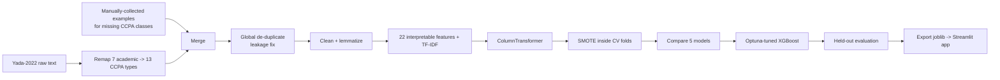

# 🔍 Dark Pattern Detector — CCPA 2023 Compliance Classifier

**Route 1: Classical NLP + Core ML.** A tool that reads a UI text string (button label,
popup, checkout message, cookie banner) and classifies it into one of **14 categories** —
the **13 dark-pattern types made illegal by India's CCPA guidelines (Nov 2023)** plus
*Not a Dark Pattern* — and flags whether it is a likely legal violation.

It uses interpretable, hand-engineered NLP features + TF-IDF feeding classical
scikit-learn / XGBoost models, and ships with a Streamlit compliance dashboard.

---

## 🇮🇳 Why this matters (Indian context)

On **30 November 2023**, India's **Central Consumer Protection Authority (CCPA)** notified
guidelines naming **13 dark patterns** as illegal under the Consumer Protection Act, 2019.
These are now enforceable violations, and regulators cannot manually review the millions of
UI strings on Indian e-commerce, SaaS and food-delivery apps. This project turns that legal
list into an automated, explainable classifier.

---

## 📈 Improvement over the Yada et al. 2022 baseline

This project builds on **Yada et al. 2022** (the e-commerce dark-pattern dataset with a
BERT/RoBERTa baseline) and extends it for the Indian regulatory setting:

| | Yada et al. 2022 (baseline) | This project |
|---|---|---|
| Label space | Binary + 7 academic (Mathur) categories | **14 classes = India's 13 CCPA legal types + benign** |
| Framing | Academic taxonomy | **Mapped to enforceable CCPA-2023 clauses** |
| Class coverage | Several CCPA types absent, heavy class skew | **All 14 covered** via manually-collected examples + balancing |
| Modeling | Transformer baseline (black box) | **Interpretable features** (you can see *why* a string was flagged) |
| Output | Dark / not-dark | **CCPA category + clause + violation flag + feature triggers** |
| Deliverable | Dataset + baseline code | **Reproducible pipeline + deployable Streamlit compliance app** |

The remapping of the 7 academic categories onto the 13 CCPA legal categories is the small
research contribution of this work.

---

## 🏆 Results (held-out test set, tuned XGBoost)

| Metric | Value |
|---|---|
| **Multi-class macro-F1** (1,085 unseen rows) | **0.969** |
| **Multi-class accuracy** | **0.971** |
| **Binary "violation?" macro-F1** | **0.97** |
| Dataset size (after global de-duplication) | **5,422 unique rows** |
| Classes | 14 |

5-fold cross-validation on the training split (macro-F1):

| Model | CV macro-F1 |
|---|---|
| Random Forest | 0.968 |
| XGBoost (tuned) | 0.964 → **0.969** after Optuna |
| Linear SVC | 0.958 |
| Logistic Regression | 0.937 |
| Complement NB | 0.797 |

> Scores are reported on a test set that shares **zero strings** with the training set, so
> the numbers reflect real generalisation, not memorisation.

---

## 🗺️ Pipeline & flow



- **Notebook 1** (`01_data_nlp_eda.ipynb`): data assembly, NLP preprocessing, feature
  engineering and EDA.
- **Notebook 2** (`02_model_tuning_export.ipynb`): model comparison, tuning, evaluation
  and model export.

---

## 🧠 Advanced techniques used

- **Hybrid feature space** — TF-IDF (bigrams, `min_df=2`, sublinear TF) combined with 22
  hand-engineered features through a scikit-learn `ColumnTransformer`.
- **RobustScaler + Yeo-Johnson** power transform on numeric features (resistant to the
  long-tailed length/keyword distributions).
- **SMOTE inside each CV fold** (via `imblearn.Pipeline`) so oversampling never leaks
  information from the validation fold.
- **Macro-F1 as the headline metric**, not accuracy — it weights all 14 classes equally
  and forces the model to learn the rarer patterns.
- **Optuna Bayesian hyper-parameter tuning** of XGBoost, optimised on **cross-validated**
  macro-F1 of the training split only; the held-out test set is scored exactly once.
- **Global de-duplication before splitting** — guarantees no string appears in both train
  and test (prevents data leakage).
- **Shared feature module** (`src/features.py`) imported by both the pipeline and the app,
  so there is no train/serve skew.

---

## 📂 Structure

```
dark-pattern-pro/
├── README.md
├── requirements.txt
├── notebooks/
│   ├── 01_data_nlp_eda.ipynb         # data, NLP & EDA
│   └── 02_model_tuning_export.ipynb  # modeling, tuning & export
├── src/
│   ├── features.py        # SHARED feature extraction (keywords, clean, 22 features)
│   ├── collect_data.py    # assemble the manually-collected example pool
│   ├── build_dataset.py   # CCPA remap + merge + global de-dup -> ccpa_dataset.tsv
│   ├── make_features.py   # apply features -> features.csv
│   └── train.py           # scripted mirror of notebook 2 (CV, Optuna, export)
├── data/
│   ├── raw/dataset_raw.tsv   # Yada-2022 source
│   └── processed/            # ccpa_dataset.tsv, features.csv
├── models/                # best_multi_model, best_binary_model, label_encoder (.joblib)
└── app/app.py             # Streamlit compliance dashboard (imports src.features)
```

---

## 🚀 Run it

```bash
pip install -r requirements.txt

# Reproduce the work (run the two notebooks top to bottom)
jupyter notebook notebooks/01_data_nlp_eda.ipynb
jupyter notebook notebooks/02_model_tuning_export.ipynb

# Launch the compliance app (uses the exported models)
streamlit run app/app.py
```

The `src/` modules provide a command-line mirror of the same workflow
(`python -m src.collect_data` → `src.build_dataset` → `src.make_features` → `src.train`).

---

## 🔬 The 22 engineered features

Keyword counts/flags (urgency, scarcity, confirm-shaming, cancellation difficulty, social
proof, drip pricing, discount, negative-option) · structural signals (all-caps ratio,
exclamation/question counts, length, word count, number present, time reference) · POS
ratios (noun/verb/adj/adv) · TextBlob sentiment polarity & subjectivity · average word
length.

EDA confirms each category lights up its own keyword family, and that dark-pattern text is
on average wordier and uses more exclamation marks, capitals and subjective language than
benign UI labels.

---

## ⚠️ Limitations

- Some CCPA categories have very few publicly available real-world strings, so their
  coverage leans on the collected example pool; the Yada-sourced classes are the toughest
  and score a little lower on the test set (*Disguised Advertisement* 0.91,
  *Interface Interference* 0.92, *False Urgency* 0.96 F1).
- Phrasings far outside the training distribution can be mis-routed; broader data
  collection (e.g. a Playwright crawl of live Indian sites) would harden the model further.
- The CCPA legal-clause mapping is an interpretive aid, **not legal advice**.
