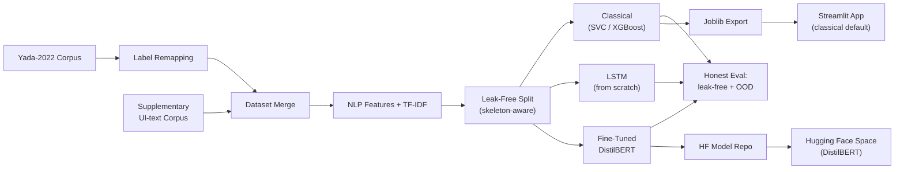

# CCPA 2023 Compliance Classifier: Dark Pattern Detector

<p align="left">
  <a href="https://dark-patterns.streamlit.app/" target="_blank">
    
  </a>
  <a href="https://huggingface.co/spaces/goyashek/distilbert-darkpattern" target="_blank">
    
  </a>
  <a href="https://github.com/goyashek" target="_blank">
    
  </a>
</p>

A compliance auditing tool that reads website/application UI text copy (e.g., urgency flags, pre-checked opt-ins, confirm-shaming prompts) and classifies it into one of **14 categories**—India's **13 illegal dark-pattern classes** established by the **Central Consumer Protection Authority (CCPA) in November 2023** plus a *Not a Dark Pattern* (safe/benign) class.

> [!NOTE]
> **Two live demos**: the fast, interpretable **classical** model on [dark-patterns.streamlit.app](https://dark-patterns.streamlit.app/), and the higher-accuracy **fine-tuned DistilBERT** on [its Hugging Face Space](https://huggingface.co/spaces/goyashek/distilbert-darkpattern). The tradeoff between them is the heart of this project.

---

## 🇮🇳 Regulatory Context & Motivation

> On **30 November 2023**, India's CCPA declared **13 categories of dark patterns** illegal under the Consumer Protection Act, 2019. 
> This tool automates the compliance review of UI text strings against these enforceable legal clauses.

---

## 🔬 Bridging Academic Taxonomy and Legal Reality

This project maps the academic baseline corpus (**Yada et al. 2022**) onto CCPA legal compliance classes.

### Comparative Analysis: Baseline vs. This Project

| Feature / Metric | Yada et al. 2022 (Baseline) | This Project |
| :--- | :--- | :--- |
| **Label Space** | Binary + 7 Academic Taxonomy Classes | **14 Classes** (13 CCPA Legal Classes + Benign) |
| **Practical Context** | Academic Research | **Regulatory Compliance & Auditing** |
| **Class Coverage** | Missing legal categories, high class skew | **All 13 CCPA classes represented** |
| **Explainability** | Black-box Transformer predictions | **Both offered**: an interpretable classical model (lexical badge triggers) *and* a fine-tuned DistilBERT |
| **Inference Layer** | Raw uncalibrated model outputs | **Precision-gate thresholding + Toned-down UI confidence** |

---

## ⚖️ The Core Tradeoff: Interpretable Classical vs. Fine-Tuned Transformer

The headline of this project isn't a single "best" score — it's an **honest tradeoff**. We took the same problem up a ladder of models and evaluated all of them on one **leak-free split** plus a held-out set of **23 real-world Indian UI strings** (out-of-distribution / OOD).

| Model | Test Macro-F1 | OOD Macro-F1 | Size | Interpretability |
| :--- | :---: | :---: | :---: | :--- |
| **DistilBERT** (fine-tuned) | **0.869** | **0.778** | ~269 MB | Low — 66M opaque params |
| Classical (Linear SVC) | 0.576 | 0.518 | ~2 MB | **High** — per-feature weights |
| Classical (XGBoost) | 0.562 | 0.302 | ~2 MB | **High** — feature importances |
| LSTM (from scratch) | 0.559 | 0.385 | ~5 MB | Low — learned embeddings |

> [!NOTE]
> **Read it as a tradeoff, not a leaderboard.** DistilBERT is far and away the most accurate, and the only model that holds up on genuinely new text (OOD 0.778 vs ~0.52 for the best classical) — but it is ~100× larger and you cannot point to *why* it fired. The classical model gives up a lot of accuracy on the hard, context-dependent classes but is tiny, instant, and every decision traces back to a keyword or feature. **So we ship classical as the fast, explainable default (Streamlit) and offer DistilBERT for the hard cases (Hugging Face Space).** The wide gap is itself the finding: on short UI strings, understanding *phrasing* beats counting keywords.

### Why a Leak-Free Split Matters

A naive random split reported a flattering **~0.96** macro-F1. But many UI strings are **near-duplicates** (same wording, different brand or price) — on this corpus **64.8%** of a naive test set has a template twin sitting in train, so the model peeks at the answer. Re-splitting by **normalized skeleton** (so no sibling group spans the split) dropped the honest classical score to **~0.56**. That ~0.40 gap is the difference between a number that looks good and a number you can trust.

### Why an Out-of-Distribution Test

In-distribution scores still flatter every model. The strongest honesty check is the **23 real Indian UI strings** scraped from live sites and kept entirely out of training. Scores there are lower for *everyone* — what matters is that the **ranking holds**, and that the transformer's edge survives contact with genuinely new text.

---

## 🗺️ Pipeline & Flowchart


---

## 🛠️ Advanced Techniques & Rationale (Why We Did Them)

### 1. Global De-duplication — and Why It Wasn't Enough
* **Why**: Removing identical UI strings before splitting is the first defense against train/test leakage.
* **The catch we found**: exact-match dedup misses **near-duplicates** (same skeleton, different brand/price). A dedicated leak audit re-split the data by **normalized skeleton** so no sibling group spans the split — which is what turned the flattering ~0.96 into the honest ~0.56 (see the tradeoff section above).

### 2. SMOTE Oversampling Inside Cross-Validation Folds
* **Why**: Solves class imbalance for rare classes (like *Subscription Trap*) without leaking validation partition data into the training process.

### 3. Robust Scaling and Power Transformation (Yeo-Johnson)
* **Why**: Normalizes feature distributions and dampens outliers for highly skewed metrics (like capitalization ratios and text lengths).

### 4. Cross-Validated Macro-F1 Optimization via Optuna
* **Why**: Forces the hyperparameter search to weight minority classes equally, preventing class neglect that occurs when optimizing for simple accuracy.

### 5. Shared Feature Extraction Module
* **Why**: Eliminates train-serve skew by ensuring text processing is performed identically in both training and production.

### 6. Inference-Time Precision Gate
* **Why**: Minimizes false positives by defaulting predictions with low classifier confidence (< 65%) to "Not a Dark Pattern".

### 7. UI Confidence Calibration
* **Why**: Tones down overconfident probability scores (99%+) in the Streamlit interface to display realistic compliance scores.

---

## 📂 Codebase Architecture

```
dark-pattern-detector/
├── README.md
├── requirements.txt
│
├── notebooks/
│   ├── 01_data_nlp_eda.ipynb              # EDA, tokenization & keyword extraction
│   ├── 02_model_tuning_export.ipynb       # cross-validation, optuna tuning & export
│   └── 03_deep_learning_transformer.ipynb # LSTM + DistilBERT on the leak-free split + OOD
│
├── data/
│   ├─ raw/
│   │   ├── dataset_raw.tsv                 # Yada et al. corpus
│   │   └── pattern_label.csv               # supplementary UI-text corpus
│   └──  processed/
│       ├── ccpa_dataset.tsv                # cleaned & remapped corpus
│       ├── features.csv                    # final data after feature engineering
│       └── ood_real_test.csv               # 23 real Indian UI strings (held-out OOD)
│
├── models/
│   ├── best_multi_model.joblib            # tuned classical model
│   ├── best_binary_model.joblib           # benign model
│   └── label_encoder.joblib               # target class encoder
│                                          # (DistilBERT weights live on the HF Model repo)
│
├── app/
│   └── app.py                             # Streamlit dashboard (classical)
│
└── hf_space/
    └── app.py                             # Gradio app for the DistilBERT HF Space
```

---

## 🚀 How to Run the Project

### Install Dependencies
```bash
pip install -r requirements.txt
```

### Reproduce the Modeling Pipeline
Run Jupyter Notebooks:
```bash
jupyter notebook notebooks/01_data_nlp_eda.ipynb               # data + 22 NLP features
jupyter notebook notebooks/02_model_tuning_export.ipynb        # classical tuning & export
jupyter notebook notebooks/03_deep_learning_transformer.ipynb  # LSTM + DistilBERT, leak-free + OOD eval
```

### Launch the Dashboards
```bash
streamlit run app/app.py    # classical model (fast, interpretable default)
```
The fine-tuned **DistilBERT** demo runs as a [Hugging Face Space](https://huggingface.co/spaces/goyashek/distilbert-darkpattern) (`hf_space/app.py`), loading its weights from a separate HF Model repo.

---

## 🔬 The 22 Engineered NLP Features
- **Lexical/Keyword Triggers**: urge_kw_count, scarcity_kw_count, shame_phrase_flag, cancel_diff_score, social_proof_flag, price_drip_flag, discount_claim_flag, neg_option_flag.
- **Structural Indicators**: all_caps_ratio, exclamation_count, question_count, text_length, word_count, number_present, time_reference_flag.
- **Part-of-Speech (POS) Mix**: noun_ratio, verb_ratio, adj_ratio, adv_ratio.
- **TextBlob Sentiment**: sentiment_polarity, sentiment_subjectivity, and average_word_length.

---

## 👨‍💻 Author & Credits
- **Created By**: [Abhishek Goyal](https://goyashek.github.io)
- **GitHub**: [github.com/goyashek](https://github.com/goyashek)
- **Kaggle Source**: Indian context compliance dataset sourced from Kaggle: **[https://www.kaggle.com/datasets/dhamur/dark-patterns-user-interfaces]**

---

## ⚠️ Disclaimer
> [!WARNING]
> This is a **test demonstration project** and does not constitute formal legal advice. Always consult a legal professional for compliance validation.


